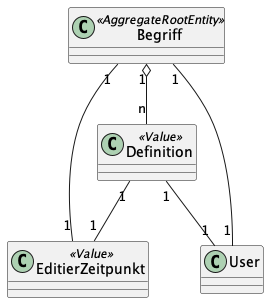
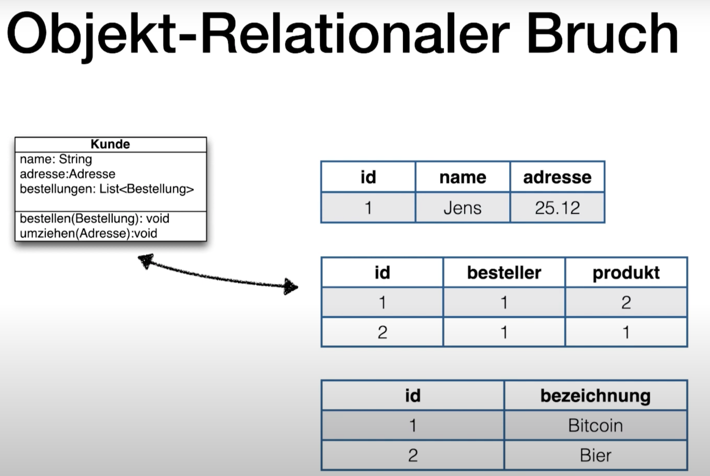
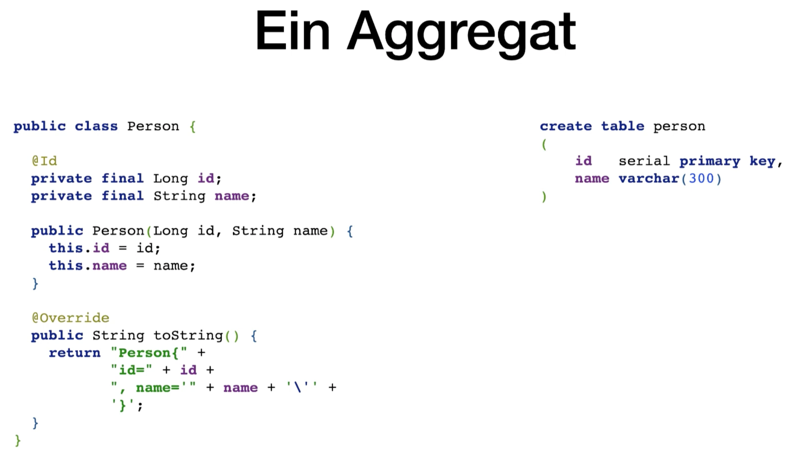
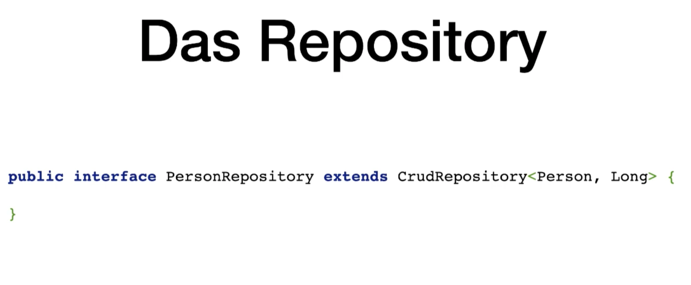

# ProPra II Zusammenfassung

# Woche 1

_Vorgehensmodelle:_
- liefern Entwicklungs-Rahmen/Leitfaden/Plan
- beschreiben wie Problem in Lösung überführt wird
- logisch und zeitlich geordneter, strukturierter Ablauf
- beschreibung von u.a. Ergebnissen, Rollen

## Sequentielle Vorgehensmodelle

Wasserfall Modell
- Aufteilung in sequentiellen Projekt-Phasen
- In den Phasen werden vom Modell vorgeschriebene Artifakte / Dokumente erstellt
- Am Ende einer Phase wir der Meilenstein abgenommen
- Eine Phase beginnt erst, wenn die vorhergehende Phase abgeschlossen ist


Pro:
- Einfaches Modell
- Projektfortschritt transparent
- Produkt ist gut dokumentiert
    - Der Prozess ist auf Dokumente ausgelegt
    - Die Dokumente weden abgenommen, müssen daher qualitativ gut sein

Contra:
- Keine gute Auslastung der Kapazitäten
- Klare Phasengrenzen sind oft nicht realisierbar
- Lösungsalternativen werden früh verworfen
- Mehraufwand durch Dokumentation
- Unflexibel gegenüber Anforderungsänderungen
- Rücksprünge sind überlicherweise notwendig
    - Wiederspruch in den Anforderungen
    - Im Test werden Bugs gefunden
- Ein Rücksprung erfordert dass alle Meilensteine neu abgenommen werden

Nur Sinnvoll, wenn Rücksprünge möglich sind und keine großen Anforderungsänderungen erwartet werden, z.B. in eingebetteten Systemen oder sicherheitskritischen Anwendungen.

## Iterative Vorgehensmodelle
- Umgeht das Problem, dass alle Annahmen von Anfang an richtig sein müssen
- Z.B. Wasserfallmodell wird mehrfach durchlaufen


Was wollen wir in den einzelnen Iterationen Entwickeln?
=> Mit einem Basissystem starten und dieses Basissytem dann schrittweise erweitern. (inkrementelle Entwicklung)

## Prototypen

Entwicklung ablauffähiger Teile der Software
- Anforderungen klären
- Machbarkeit überprüfen
- Alternativen erforschen
- Erfahrungen mit nicht vertrauten Technologien sammeln

**vertikaler Prototyp**
- Ausschnitt quer durch alle Schichten der Anwendung
- Überprüfung der Machbarkeit
- Einzelne Funktionalitäten implementieren


**Horizontale Prototyp**
- Entwicklung einer einzelnen Schicht ohne Implementierung anderer Schichten
- Anforderungsstabilisierung
- Meistens UI


**Vorteile:**
- Risikominimierung
- Konkrete Vorstellung
- Basis für weitere Planung

**Nachteile:**
- Aufwand
- Gefahr durch falsche Ausschnittswahl

**Achtung:** Nie die Entwicklung mit einem Kern, der aus einem zusammengehackten Wegwerfprototyp besteht, starten. Der Wegwerfprototyp hatte das Ziel etwas zu lernen und dieser Zweck ist erfüllt.

## Agile Vorgehensmodelle
Die Entwicklung findet in kurzen iterativen Zyklen statt. Man fängt mit den wichtigsten Anforderungen an und nach jedem Zyklus wird die Anwendung erprobt und daraus gelernt.

Anforderungen:
- ständigen Austausch mit Product Owner (schnelle Feedbackschleife)
- Jederzeit Änderungen der Anforderungen begrüßen
- Dafür hohe Wartbarkeit der Software garantieren

Vorteile:
- Berücksichtigung von Anforderungsänderungen
- Feedback vom Kunden durch häufiges Ausliefern
- Fördert Kooperation im Team
- Sehr gut geeignet für Neuentwicklungen

Nachteile:
- Vertrag
- Beteiligung des Kunden wichtig
- Dokumentation weniger umfangreich

## Domain Driven Design DDD
Ziel ist die Software möglichst nah an den Prozessen und Fachmodellen der Domäne anzulehnen

### Domain
Ein Bereich von Wissen, Einfluss oder Aktivität. Das Fachgebiet, auf das der Benutzer ein Programm anwendet, ist die *Domain* (Dt.: Domäne) der Software.

### Model
Ein *Model* (Dt.: Modell) ist ein System von Abstraktionen, das ausgewählte Aspekte einer Domäne beschreibt und zur Lösung von Problemen im Zusammenhang mit dieser Domäne verwendet werden kann.

### Ubiquitous Language
Die Ubiquitous Language (Dt.: allgegenwärtige Sprache) ist eine Sprache, die um das Domänenmodell herum gruppiert ist und von allen Teammitgliedern in einem Bounded Context verwendet wird, um alle Aktivitäten des Teams mit der Software zu verbinden.
Typische Hindernisse:
- Fehlende Fachbegriffe
- Unterschiedliche Bedeutungen
- Übersetzungsfehler

### Context
Der Bereich, in dem ein Wort oder eine Aussage auftaucht und der dabei ihre Bedeutung bestimmt. *Aussagen über ein Modell können nur in einem Context (Dt.: Kontext) verstanden werden.*

### Bounded Context
Der Bounded Context (Dt.: begrenzter Kontext) ist eine Beschreibung einer Grenze (typischerweise ein Subsystem oder die Arbeit eines bestimmten Teams), innerhalb derer ein bestimmtes Modell definiert und anwendbar ist.

## Domain Storytelling
Um Wissen über die Domäne zu sammeln, gibt es im DDD sogenannte Knowledge Crunching Techniken, wie u.a. Domain-Storytelling. Das ist ein Workshop-Format, bei dem einzelne Szenarien aus der Domäne *gemeinsam durchgesprochen* und *visualisiert* werden.

# Woche 2

## Software-Architektur
## Entwicklung planen
Besonders die ersten drei Kapitel des Templates sind für uns interessant.


Ziele
Das erste Kapitel der Dokumentation soll einen schnellen Überblick darüber geben, welche Ziele die Software erreichen soll (auch Qualitätsziele)

Stakeholder
Stakeholder-Analyse durchführen
Wenn wir die Gruppen mithilfe dieses Rasters klassifiziert haben, können wir gezielter mit ihnen interagieren.


Einschränkungen
Budget, Personalausstattung und auch Qualifikationen des Teams

Kontextabgrenzung
Funktionalitäten die zum System gehören und in welcher Beziehung unser System zu Usern und externen Systemen steht

## Muster

### Das Schichtarchitektur-Muster
In einer strikten Architektur haben wir eine losere Kopplung, da eine Schicht ausschließlich eine andere Schicht verwendet. Der Preis dafür ist aber, dass wir evtl. viele Methoden liefern müssen, die Aufrufe in tiefere Schichten weiterleiten. Das kann die Performance einer Anwendung negativ beeinflussen.

Vorteile
- Einfach und leicht zu verstehen
- Klare Abhängigkeiten
- Reduktion der Kopplung von Komponenten (SRP, LCHC Low Coupling, High Cohesion)
- einheitlicher Abstraktionsgrad
- Austausch von ganzen Schichten

Nachteile
- Bei Änderungen in der untersten Schicht müssen alle darüberliegenden Schichten geändert werden


Bei den Aggregate kann es eine Klasse geben, die mehrere vollkommen unterschiedliche Aufgaben hat. Einerseits die Geschäftsaufgaben, andererseits z.B. sich aus der Datenbank zu laden und zu speichern. Das ist ziemlich deutlich eine Verletzung des Single Responsibility Prinzips.

Lösung: Das Repository-Pattern
- Verschiebung der Verantwortung der obigen Klasse in eine dedizierte Klasse (Repository). Das Repository stellt Lade- und Speicheroperationen für fachliche Objekte bereit, die Datenbank wird dabei abstrahiert. Für den aufrufenden Code wirkt ein Repository wie eine Sammlung von Fachobjekten und befindet sich nun in der Persistenzschicht.

- Mit Dependency Inversion erstellen wir zueltzt noch ein Repository-Interface in der Geschäftslogik und implementieren das Interface in der Persistenzschicht.

=> Dadurch erhalten wir die Onion Architektur

## Die Onion-Architektur
Wenn wir die Dependencies der Schichten, die von der Geschäftslogik aufgerufen werden, umdrehen, erhalten wir ein Architekturmuster, dass als Ports-and-Adapters (aka Onion Architektur) bezeichnet wird.


- Controller extrahieren Daten aus dem Request und bauen ModelAndView zusammen
- Application Services koordinieren einen Geschäftsvorfall (Daten laden, Geschäftslogik aufrufen, Daten speichern)
- Das Domänen Modell setzt die Geschäftsregeln um
- Repositories
    - Haben eine fachliche Schnittstelle in der Geschäftslogik
    - Werden in der Infrastrukturschicht implementiert
    
# Woche 3

## Zerlegungen eines Systems
Zerlegung eines Gesamtsystems. Ein Software-System kann aus einem oder mehreren ausführbaren Programmen bestehen. Entweder Monolithen oder Microservice-Architekturen oder etwas dazwischen.

## Code-Organisation und Building
Wir haben die Auswahl, ob wir alle Services in einem einzigen Code-Repository (Monorepo) oder jeden Microservice (oder Gruppen von Services) im jeweils eigenen Repository (Polyrepos) entwickeln.

## Technologie-Stack
Ist die Auswahl der Technologien, die benutzt wird, um eine Software umzusetzen (z.B. Betriebssystem und ggf. Virtualisierungen, Programmiersprachen, Frameworks, externe Softwareprodukte wie Datenbanken oder Messagebroker ...)
Im gegensatz zum Microservice gibt es im Monolithen nur einen Technologie-Stack.

## Transaktionen
Wenn wir in einem Programm darauf angewiesen sind, dass sich Zustand nur konsistent ändert, werden Transaktionen wichtig.
Als Transaktion eine Folge von Programmschritten bezeichnet, die als eine logische Einheit betrachtet werden, weil sie den Datenbestand nach fehlerfreier und vollständiger Ausführung in einem konsistenten Zustand hinterlassen. Daher wird für eine Transaktion insbesondere gefordert, dass sie entweder vollständig und fehlerfrei oder gar nicht ausgeführt wird.

## Monolithen

### Pro
- Übersichtliche Gesamtstruktur (Build, Deployment, ...)
- Interaktion über normale Methodenaufrufe
    - Hohe Performance
    - Zuverlässig
    - Entwicklung einfacher
- Transaktionen sind gut umsetzbar
    - Konsistenz von Daten gut einhaltbar

### Contra
- Modularisierung kann einfach umgangen werden
    - Disziplin mit Archunit
    - Modularisierung durch Submodule
- Ein Prozess = Eine Plattform
- Blast Radius bei Fehlern
    - Bei einer ungefangenen Exception stürzt das gesammte System ab.
- Skalierung (Performance und Entwicklung)

## Microservices

Monolith wird in mehrere Anwendungen aufgeteilt. Die Kommuniktation zwischen den Services geschieht nun über das Netzwerk.

### **Skalierung**

→ Unabhängige Skalierung einzelner Bestandteile

### **Komponentenbildung**

→ Modularisierung nun stärker eingehalten. Netzwerkaufruf für jeden Aufruf zwischen Komponenten notwendig

### **Polyglotte Programmierung**

→ Microservices können unabhängige Technologien verwenden. Man kann die passenste Technologie für die bewältigung der Aufgabe wählen.

### **Robustheit**

→ Blast Radius begrenzt. Stürzt ein Service ab laufen andere Services trotzdem weiter.

Nicht automatisch robust. Abhängigkeiten zwischen Services führen trotzdem zu abstürzen. Die Aufrufe zwischen Services sind nicht mehr zuverlässig.

### **Aufteilung**

Bei falscher Aufteilung verschmelzen die Nachteile von Monolithen und Microservices. Wenn für das Deployment alle Services vorhanden seien müssen, so gibt es eine falsche Aufteilung. Services sollen unabhängig von einander deployed werden können. → Autonomie

1. Aufrufe minimieren
2. Tennen zwischen Micro und Makroarchitektur

### **Makroarchitektur**

- Regeln für die Systemintegration und Kommunikation
- Regeln für die Authentifizierung und andere Metadaten
- Regeln für das Deployment und Konfiguration
- Regeln für das Monitoring

### **Autonomie**

- Services werden unabhängig voneinander entwickelt und in Betrieb genommen
- fachlichen Schnitt wählen (Bounded Context)

### **Pro**
- Technologiestack frei wählbar
- Grenzen im Code (Modularisierung)
- Services können ausgetauscht werden
- System kann auch bei Ausfall eines Services weiter funktionieren
- Skalierung ist feingranularer
- Weniger teamübergreifende Koordination

### **Contra**
- Aufrufe nicht mehr zuverlässig
- Verteilte Transactionen
- Emergentes Verhalten (Verteilter Aufruf von Code)

## Skalierung
Einen Monolithen können wir nur vollständig skalieren. Wenn wir den Produktkatalog skalieren, dann wird der Versand mitskaliert. Bei einer Microservice-Architektur können wir die Services unterschiedlich stark skalieren und auf den Bedarf anpassen.

### Vertikale Skalierung (Scale Up)

- Erhöhen der Ressourcen des Servers
- Pro
    - Keine Änderung der Software notwendig
- Contra
    - Teuer
    - Irgendwann nicht mehr möglich.

### Horizontale Skalierung (Scale Out)

- Erhöhung der Anzahl der Server
- Pro
    - Günstiger
    - Keine Hardware Grenzen
- Contra
    - Effzienz der Software entscheidend
    - Symmetrische Skalierung
        - Wenn eine Anwendung im System viel öfter genutzt wird als andere Bestandteile, so muss trotzdem die gesamte Anwendung dupliziert werden.
        - Einzelteile können nicht eigenständig skaliert werden
        - Führt zu Verschwendung von Ressourcen
    - Time to Market
        - Koordination ist problematisch
            - Feature Release
                - Man wartet auf das neue Feature das gebraucht wird, bis es fertig ist
            - Release Trains
                - Nach einem bestimmten Zeitintervall (z.B. alle drei Montate) werden alle fertigen Features released


- Zustand muss zwischen den Servern geteilt werden
    - Kann gelöst werden durch Sticky Sessions (Requests vom selben User gehen an den selben Server)
    - Zustand kann immer mitgesendet werden
    - Zustand kann in einer geteilten Datenhaltung abgelegt werden

## Teamstrukturen
Conway's Law: Die Struktur von Systemen, die von einer Organisation entwickelt werden, die Kommunikationsstrukturen innerhalb der Organisationen widerspiegelt.

Conway’s Law ist ganz besonders in Microservice-Architekturen von Bedeutung, aber auch in einem Monolithen können wir Modulgrenzen haben, die dann ebenfalls von der Organisationsstruktur mitbestimmt werden.

Conway's Law positiv nutzen:
Organisation so ändern, dass wenn wir sie kopieren, genau die Architektur bekommen die wir eigentlich planen. Ändere nicht die Software-Architektur ohne das Team anzupassen.
Z.B. durch Zwei-Pizza-Teams (Teams die mit zwei Pizzen satt zu kriegen sind):
- 2-8 Personen
- alle rollen in einem Team beteiligt
- feste Teams mit einer Aufgabe


## Was ist denn eigentlich ein Microservice?
Ein Microservice kann nicht kleiner sein als ein Aggregat. 
Auf der anderen Seite soll ein Microservice von einem einzigen Team handhabbar sein, sodass wir das als Obergrenze für einen Service verwenden können.

Microservices möglichst autonom entwickeln und betreiben. Erreichen wir dadurch, dass wir die Services fachlich schneiden und ihre Abhängigkeiten zu anderen Prozessen kontrollieren. Sodass ein Service genau eine Aufgabe möglichst vollständig umsetzt.


## Verteilte Monolithen
Wenn wir eine Microservice-Architektur nicht sinnvoll schneiden, dann kann es uns passieren, dass wir einen verteilten Monolithen entwickeln.
Verteilte Monolithen sind ein Riesenproblem, da die Nachteile von Monolithen mit den Nachteilen von Microservices kombiniert werden.

## Zwischen den Extremen
Wir müssen nicht für entweder Monolithen oder Microservices entscheiden. Es gibt Lösungen, die dazwischen liegen. (siehe Self-Contained-Systems (SCS))

## Wie zerlegen wir denn nun ein System?

Z.B. können wir fachliche und technische Zerlegung kombinieren, siehe folgende Struktur:


In den meisten Fällen ist die fachliche Zerlegung ein guter Startpunkt.
- Fachlich geschnittene Teilsysteme lassen sich gut auf Teams verteilen.
- Ein Monolith lässt sich dadurch im Nachhinein einfacher in Services zerlegen

Technische Zerlegung in Frontend und Backend zuerst durchführen. Wichtig wenn wir getrennte Technologien verwenden wollen.

Monolith oder viele Microservices?
- Zuerst mit einem oder einigen wenigen Monolithen starten
- Bei mehreren Monolithen den Schnitt unbedingt entlang von Bounded-Contexts vornehmen

# Woche 4

## URLs
Eine URL besteht aus dem Namen eines Schemas, gefolgt von einem Doppelpunkt. Das Schema bestimmt, wie der Teil nach dem Doppelpunkt interpretiert wird


- Authority ist die Adresse (typischerweise ein DNS-Name oder eine IP-Adresse) der für den Rest der URL zuständigen Entität.
- Path und Query gemeinsam bilden den Bezeichner einer Ressource, die von der Authority verwaltet wird
- 
## Das Hypertext Transfer Protocol (HTTP), Teil 1
### Versionen
Es gibt drei HTTP-Versionen: 
- HTTP/1.1: Klartextprotokoll
- HTTP/2: binär
- HTTP/3: binär

Die Versionen 1.1 und 2 verwenden TCP als Transportprotokoll, Version 3 verwendet das Transportprotokoll QUIC. Sowohl TCP als auch QUIC sind zuverlässige Transportprotokolle

### Request und Response
 


Bedeutung der Statuscodes:


### Struktur 
HTTP ist nur für die logische Strukturierung zuständig, nicht für das Aussehen.

### HTTP-Verben
- Resourcen sind Dinge mit einer Identität, die mit einer URL adressierbar sind
- Wir bekommen nicht die Resourcen sondern Repräsentationen
- Welche Repräsentationen wir bekommen ist Verhandlungssache zwischen Client und Server
- Die HTTP Verben GET, POST, PUT und DELETE u.a. bilden eine einheitliche Kommunikation


## Accessibility
(dt. oft Barrierefreiheit)
Grundregeln:
- Mausbedienung ermöglichen (Anwendung auch mit der Tastatur bedienbar)
- Farbwahrnehmung und Kontraste beachten
- Skalierbarkeit der Schriftgröße etc. ermöglichen
- Bilder mit Alternativtexten versehen
- Formularfelder mit Labeln versehen
- Mit **Screenreader** Bedienbarkeit prüfen

# Woche 5

## Webanwendungen in Java

### Servlet 
Ist eine Klasse, in der wir das Verhalten einer Webanwendung für eine URL oder eine Gruppe von URLs implementieren. Der Servlet-Container stellt für uns die komplette Infrastruktur bereit und kümmert sich um die Kommunikation mit einem Client über HTTP

- Der Webserver verteilt Anfragen aufgrund einer Konfiguration, in der URLs auf Servlets abgebildet werden.
- Der Webserver ruft in dem Servlet eine der doXXX-Methoden auf. Welche Methode aufgerufen wird, hängt vom HTTP-Verb des Requests ab.
- Die Methode hat Zugriff auf die Request-Daten (URL, Parameter, Header, ...) über ein Objekt vom Typ HttpServletRequest.
- Die Methode ändert den Zustand eines Objekts vom Typ HttpServletResponse. Dort können Header gesetzt oder der Body der Antwort erzeugt werden.
- Wenn die Methode beendet ist, wird aus dem geänderten HttpServletResponse-Objekt eine Antwort für den Browser erzeugt und abgeschickt.

## Webanwendungen mit Spring Web MVC
Das Spring Framework stellt über die Servlet-Abstraktion hinaus eine höherwertige Abstraktion bereit. Unter der Haube verwendet Spring allerdings auch Servlets.


Der Request kommt beim DispatcherServlet an. Im Handler mapping wird die entsprechende Methode zurückgegeben, die die angeforderte URL im Request verarbeiten kann. Danach wird diese Methode im jeweiligen Controller aufgerufen, welcher ein Model (HashMap mit Key-Value Paaren) und ein Logischen View Name (Name einer HTML-Datei in der bestimmte Daten erstetzt werden können). Im ViewResolver wird das View Template anhand des Namen geladen  und letztlich im DispatchServlet mit dem Model vereinigt und als Response zurückgegeben.


Sollte man kein View-Template benutzen wollen, so kann man im Controller z.B. JSON oder einen String mit HTML Code zurückgeben und als Resonse verschicken.

```java
@RequestMapping(method=RequestMethod.GET, path="/")
public @ResponseBody String index(){
	return "Hallo!";
}
```
```java
@RequestMapping(method=RequestMethod.GET, path="/")
public void index(HttpServletResponse resp) throws IOException{
	resp.setContentType("text/html");
	resp.getWriter().printlin("Hello!");
}
```

## Validierung

Eine Klasse von Sicherheitslücken im Bereich der Webanwendungen sind Injection-Angriffe. Es gibt unterschiedliche Varianten von Code-Injektion und Cross-Site-Scripting-Angriffen bis zu den SQL-Injections. Das gemeinsame Problem ist, dass Userinput nicht hinreichend überprüft wird.

**Niemals darauf verlassen, dass Eingaben in einem Request valide sind!**

### Objekt mit Validierung

```java
public class PersonForm {

	@NotNull
	@Size(min=2, max=30)
	private String name;

	@NotNull
	@Min(18)
	private Integer age;

	public String getName() {
		return this.name;
	}

	public void setName(String name) {
		this.name = name;
	}

	public Integer getAge() {
		return age;
	}

	public void setAge(Integer age) {
		this.age = age;
	}

	public String toString() {
		return "Person(Name: " + this.name + ", Age: " + this.age + ")";
	}
}
```

### Controller mit @Valid

```java
@GetMapping("/")
public String showForm(PersonForm personForm) {
	return "form";
}

@PostMapping("/")
public String checkPersonInfo(**@Valid PersonForm personForm, BindingResult bindingResult**) {

	if (bindingResult.hasErrors()) {
		return "form";
	}

	return "redirect:/results";
}
```

### HTML mit Validierung

```
<form action="#" th:action="@{/}" th:object="${personForm}" method="post">
    <table>
        <tr>
            <td>Name:</td>
            <td><input type="text" th:field="*{name}" /></td>
            <td th:if="${#fields.hasErrors('name')}" th:errors="*{name}">Name Error</td>
        </tr>
        <tr>
            <td>Age:</td>
            <td><input type="text" th:field="*{age}" /></td>
            <td th:if="${#fields.hasErrors('age')}" th:errors="*{age}">Age Error</td>
        </tr>
        <tr>
            <td><button type="submit">Submit</button></td>
        </tr>
    </table>
</form>
```

# Woche 6

## Testpyramide


## Was können wir testen?


### WebMvctest
Für Tests der Webschnittstelle annotieren wir Test-Klasse mit @WebMvcTest-Annotation. Damit konfigurieren wir JUnit und Spring so, dass nur ganz bestimmte Klassen der Anwendung in den Spring-Kontext geladen werden. 
Nur Klassen mit @Controller, @RestController und @ControllerAdvice werden für die Dependency Injection geladen. Alle anderen Klassen aus unserer Anwendung, die in einem unserer Controller benötigt werden, müssen wir selber bereitstellen. In den allermeisten Fällen wollen wir diese Klassen durch Mocks ersetzen.


### Controller testgetrieben entwickeln
Wenn wir einen Test für die Klasse schreiben wollen und wir @WebMvcTest verwenden, dann können wir uns im Test ein Objekt vom Typ MockMvc injizieren lassen. Dieses Objekt bildet unsere Schnittstelle zum Weblayer. Wir können es verwenden, um Requests zu simulieren, ohne dabei den echten Servlet-Container zu verwenden.

```
@WebMvcTest //oder @WebMvcTest(LottoController.class) um nicht alle Controller in Kontext zu bringen
public class ControllerTest {

  @Autowired
  MockMvc mvc;
  
  @MockBean
  LottoService service;

  @Test
  @DisplayName("")
  void test_lotto() throws Exception {
    when(service.getTipp()).thenReturn(List.of(8, 15, 22, 27, 39, 41));
    MvcResult tipp = mvc.perform(MockMvcRequestBuilders.get("/tipp"))
        .andReturn();
    ...
  }
```

Hier simuliert MockMvc-Objekt einen Request.
@MockBean damit das Framework ein Mock-Objekt vom Typ LottoService für die Injektion verwendet und wir das Objekt dann im Test konfigurieren können.
Mit andExpect-Methode überprüft man bestimmte Assertions der Antwort des Controllers.
Mit andReturn bekommen wir ein MvcResult, welches die gesamten Informationen der HTTP-Response kapselt und das wir dann genauer inspizieren können.

#### MockMvcResultMatchers
Nachdem wir die perform-Methode mit einem MockHttpServletRequestBuilder aufgerufen haben, wird der Controller-Code ausgeführt und wir bekommen ein Ergebnis in Form einer Instanz von ResultActions zurück. Das Objekt stellt zwei wesentliche Methoden zur Verfügung, mit denen wir Assertions formulieren können.

Mit andReturn eine Instanz von MvcResult besorgen. Interesannte Methoden:
- getResponse gibt uns ein MockHttpServletResponse-Objekt zurück, welches uns Informationen wie Header, Status und Body der HTTP-Antwort bereitstellt.
- getModelAndView gibt uns das ModelAndView-Objekt zurück, das Spring verwendet hat, um die Antwort auf den Request zu produzieren.

Ausschnitt mit einigen besonders wichtigen Matchern (wie z.B. MockMvcResultMatchers.status().isOk()):


# Woche 7

## Zustand und HTTP
HTTP ist Zustandsfrei. Entweder muss der komplette Zustand mitgeschickt werden oder man verwendet einen Bezeichner, der den Zustand auf dem Server identifiziert. Zustand auf dem Server verbraucht Speicher → Dos oder DDos Attacken.

Zustandstransfer:
- Pfad + requestparameter
- Request Body
- Response Body
- Cookies

Wir sollten vermeiden, Zustand auf dem Server halten zu müssen. Eine Möglichkeit dafür ist es, den relevanten Kontext für eine Anfrage bei jedem Request zu übertragen. Diese Übertragung können wir per Parameter oder per Cookie durchführen.

### Hidden Fields

Hilfreich bei Multistage Formularen. Das n+1-Formular erhält die Informationen vom Server aus den vorherigen n Formularen und schickt zusammen mit den neuen zusätzlichen Informationen an den Server zurück.

```java
<form method="post" th:action="@{/page2}">
	<input type="hidden" name="name" th:value="${name}">
	<label>Twitter Handle:
		<input type="text" name="twitter">
	</label>
	<buttom type="submit">Ende</button>
</form>
```

### Cookies

Key-Value-Paar im Browser und ist Eigentum des Clients. Werden immer mit gesendet, nachdem sie gesetzt wurden.

```java
@GetMapping("/")
public String counter(
	HttpResponse resp, 
	Model m, 
	@CookieValue(name="counter", defaultValue="0") int count){
	m.addAttribute("count", count);

	String newValue = String.valueOf(count+1);
	Cookie counter = new Cookie("counter", newValue);
	counter.setHttpOnly(true);
	counter.setSecure(true);
	response.addCookie(counter);

	return "main";
}
```

###

## Sessions
Arten von Zustand auf dem Server:
- Persistenter Zustand durch Speichern als Ressource (z.B. Warenkorb)
- Flüchtiger Zustand (Session)


- Annotation für die Controller Klasse
- `@SessionAttributes({"log", "username"})` Array mit Strings, die wir länger speichern wollen und erhlten bleiben wenn wir die ins Model geben
- Model-Einträge bleiben erhalten bis Session ausläuft 

`@ModelAttribute` kann an Methoden und Parametern geschrieben werden. Sollte im Model ein bestimmter Wert nicht gesetzt sein, wird die Methode aufgerufen, die mit @ModelAttribute annotiert ist und erzeugt dann einen Wert.

```java
@ModelAttribute("log")
public LogEntry createModelAttribute(HttpServletRequest req){
	String ip = req.getRemoteAddr();
	return new LogEntry(ip);
}

@GetMapping("/get")
public String getObjectFromModel (@ModelAttribute("log") LogEntry log){
	log.addLog("Request get");
	return "model";
}
```

`@SessionAttribute` ist eine Annotation für die Controller-Klasse. In der Annotation können Schlüssel-Namen definiert werden für das Modell: `@SessionAttribute({”log”, “username”})`

`@SessionScope` erstellt eine Instanz des Controller pro Session. Damit können dann Variablen in der Klasse gespeichert werden (Zustand per Instanzvariable).

→ Nachteil: Benötigt mehr Ressourcen.

## Sicherheit von Webanwendungen
### Verschlüsselte Kommunikation

### Symmetrische Verschlüsselung

Nachricht wird mit dem geteilten Schlüssel verschlüsselt und kann auch nur mit dem selben Schlüssel wieder lesbar gemacht werden. 

- Schnell
- Setzt vorraus, dass beide Parteien einen gemeinsamen, geheimen Schlüssel haben
    - Pro Kommunikationspartner wird ein Schlüssel gebraucht
    - Der Schlüssel muss sicher verwahrt werden
    - Der Schlüssel muss sicher ausgetauscht werden

### Asymmetrische Verschlüsselung

Nachricht von Partei A wird mit dem Publickey der Partei B verschlüsselt. Dieser ist frei verfügbar. Die Nachricht von A kann dann nur mit dem Privatekey der von B entschlüsselt werden.

- Langsam
- Alle die mit Partei B reden wollen, können denselben Publickey verwenden
- Partei B muss seinen Privatekey sicher speichern

Eine Kombination von den beiden Verfahren ermöglicht einen sicheren Austausch des für die symmetrische Verschlüsselung notwendigen geteilten Schlüssel.

### Signaturen

Um sicher zu stellen, dass der Publickey der Parteil B der echte Schlüssel ist, werden Nachrichten Signiert. Nachrichten können mit dem Privatekey verschlüsselt werden und mit dem Publickey wieder entschlüsselt werden.

Wenn Partei A nun eine Nachricht senden will, so wird die Nachricht zuerst durch eine Hashfunktion codiert und mit dem Privatekey von Partei A verschlüsselt. Zusammen mit der gehashten Nachricht und der Nachricht im Klartext (oder auch verschlüsselt) werden die beiden Nachrichten an Partei B verschickt. Partei B entschlüsselt mit dem Publickey von Partei A die gehashte und mit dem Privatekey verschlüsselte Nachricht von Partei A. Die Klartextnachricht wird mit der selben Hashfunktion gehasht und mit der entschlüsselten Nachricht verglichen.

### Zertifikate

Serverbetreiber erstellen einen Certificate-Signing-Request (Domain, Organisation, Adresse,...) mit dem Publickey des Servers. Die CA signiert dann das Zertifikat mit ihrem Privatekey.

Rootzertifikate sind fest in Betriebssystemen bzw. Browsern eingebaut, denen direkt vertraut wird.

## CSRF

### Angriff

Wenn der Benutzer auf einer bösartigen Website landet, kann diese versuchen einen Request auf eine für CSRF anfällige Website zu senden. 

In dem Request befinden sich standardmäßig alle Cookies die im Browser zu der Website gespeichert sind. 

Die vulnerable Website hält dann diesen Request für legitim. 

Nun ist es möglich, dass der Benutzer durch diesen Request authetifiziert. Dies ermöglicht dem Angreifer Änderungen auf der Seite vorzunehmen (Mail ändern, Überweisung tätigen, ...).

### Abwehr

Jedes auf der Webiste verfügbares Formular erhält ein benutzerspeziefischen Token. Wird der richtige Token beim abschicken des Formulars mitgeschickt, ist die Anfrage ligitim. 

Der Token kann nicht abgegriffen werden: 

- Der Angreifer könnte selber versuchen die Website aufzurufen, jedoch bekommt er einen für sich speziefischen Token.
- Sollte er versuchen mittels des Browsers des Benutzers den Token zu erhalten, wird dies durch die Same-Origin-Policy und CORS (Cross-Origin Resource Sharing) Einstellungen verhindert.
    - Javascript kann wegen der Same-Origin-Policy ****von der bösartigen Website keinen Request an die vulnerabe Website stellen.

In Spring kann man dies mit einem hidden field erreicht werden:

```java
<input type="hidden" th:name="${_csrf.parameterName}" th:value="${_csrf.token}"/>
```

oder man verwendet im `form` tag das attribut `th:action="@{/...}"`.

## Cross Site Scripting

### Reflect XSS

Schadcode wird dem Server geschickt und dieser integriert den Schadcode in der Seite. Der Schadcode wird nun im Browser gerendert und ausgeführt.

### Stored XSS

Schadcode wird in der Datenbank gespeichert und jedes Mal mitgeliefert.

## Zugriffskontrolle

### Authentifizierung

Methoden zur Authentifizierung **immer mit HTTPS**:

- Basic HTTP-Authentication (Kein serverseitiger Logout möglich)
- Session Cookie
    - Benuzter erhält ein Session Cookie. Wenn der Benuzter sich erfolgreich authentifiziert, wird serverseitig sich gemerkt, dass er auf bestimmte Ressourcen Zugriff hat.
    - Beim Logout kann die Session auf dem Server gelöscht werden. Versucht der Benutzer auf eine geschützte Ressource zuzugreifen wird weiterhin der veraltete Session Cookie mitgesendet. Der Benutzer wird dann wieder zum Login geleitet.
    - Probleme entstehen bei Proxies und Load Balancern. Die Sessions müssen entweder zwischen den Anwendungen geteilt werden, oder die Sessions werden im Proxy gehandhabt.
- Access Token (Stateless)
    - Der Client erhält einen Cookie mit allen für die Session notwendigen Informationen (Benutzername, Rollen, Sessiondauer, ...)
    - Der Inhalt des Cookies wird vom Server signiert. Es wird ein geheimer Schlüssel gewählt der zusammen mit dem Payload des Cookies gehasht wird. Dem Client wird der klartext Payload und der gehashte Payload mit Schlüssel gegeben.
    - Der Server überprüft die Güligkeit des Tokens. Berechnet mit dem klartext Payload und dem geheimen Schlüssel einen Hashwert und vergleicht diesen mit dem mitgesendeten gehashten Payload.
    - In der Anwendung kann entweder mit Symmetrischer Signatur oder Asymmetrischer Signatur gearbeitet werden
    - Nun kann auch ein Proxy verwendet werden, um einfache Überprüfungen vorzunehmen (Token vorhanden oder nicht) oder der Proxy übernimmt die Validierung des Tokens.
    - JWT (JSON Webtoken)
    - OAuth 2

### Reverse Proxy
Statt die Verschlüsselung direkt zwischen Client und Server aufzubauen, wird die TLS-Verschlüsselung oft durch eine Netzwerk-Komponente wie einen reverse Proxy gehandhabt. Dadurch dass wir einen Proxy verwenden, ist das Thema TLS an den Betrieb ausgelagert worden.


Vorteile:
- Wir können innerhalb des Systems Änderungen vornehmen, ohne dass das nach außen sichtbar wird.
- In Browsern gibt eine Sicherheitsmaßnahme, die sogenannte Same-Origin-Policy, die verhindert, dass JavaScript auf Inhalte zugreift, der nicht von derselben Quelle (Protokoll, Host und Port müssen übereinstimmen) kommt wie das JavaScript.
- Der Proxy kann das Ausliefern von statischen Ressourcen (Bilder, CSS, JavaScript, …) übernehmen.
- Der Proxy ist die einzige Stelle für eingehende Requests, wir können dort also Sicherheitsmaßnahmen unterbringen.
- Wir konfigurieren die TLS-Verschlüsselung vollständig im Proxy.

## Spring Security

### Authentication

In Spring arbeitet mit dem Spring-Security-Filter. Dieser Filter sitzt vor den Servlets, die die Requests verarbeiten. Innerhalb dieses Filters sitzt ein Authentication-Filter, der sich um die Authentifizierung kümmert. Alle Requests werden von ihm abgefangen und entsprechend der Konfiguration überprüft. Filter können so konfiguriert werden, dass sie nur bestimmte URL’s Authentifizierung benötigen, wie z.B. `/admin/XXX`. 


Die Zugangsinformationen werden innerhalb eines `Authentication` Objekts an den `AuthenticationManager` weitergeleitet. Dieser leitet das Objekt an den entsprechenden `AuthenticationProvider` weiter, der für die speziefische Anmeldemethode, die Authentifizierung übernimmt. Der `AuthenticationProvider` gibt dem `UserDetailsService` den Benutzernamen und erhält z.B. aus der Datenbank ein `UserObjekt`, welches bei erfolgreicher Anmeldung in das anfängliche `Authentication` Objekt als Principal gespeichert wird.


Im Controller kann auf diesen Principal mittels Injektion zugegriffen werden:

```java
@ModelAttribute("handle")
String handle(Principal user) {
    return user.getName();
}
```


### In-Memory Authentication

Für eine Inmemory Authentifizierung konfiguriert man den `AuthenticationManagerBuilder` direkt. Mittels Injection erhält man ihn, indem man eine Klasse `WebSecurityConfiguration` mit der Klasse `WebSecurityConfigurerAdapter` erweitert, mit `@EnableWebSecurity` annotiert und dort die Methode `configure` überschreibt. Hier werden die Benutzer definiert (Benutzername, Password, Rolle). Zusätzlich muss eine Bean definiert werden, die das Passwordencoding handhabt.

### GitHub Authentication

Um GitHub Authentifizierung zu verwenden müssen folgende Klassen erstellt werden:

`MethodSecurityConfiguration`

```java
@Configuration
@EnableGlobalMethodSecurity(
    prePostEnabled = true,
    securedEnabled = true,
    jsr250Enabled = true)
public class MethodSecurityConfiguration extends GlobalMethodSecurityConfiguration {
}
```

`SecurityConfiguration`

```java
@Configuration
public class SecurityConfiguration {

  @Bean
  protected SessionAuthenticationStrategy sessionAuthenticationStrategy() {
    return new RegisterSessionAuthenticationStrategy(
        new SessionRegistryImpl());
  }

  @Bean
  public OAuth2AuthorizedClientManager authorizedClientManager(
      ClientRegistrationRepository clientRegistrationRepository,
      OAuth2AuthorizedClientRepository authorizedClientRepository) {

    OAuth2AuthorizedClientProvider authorizedClientProvider =
        OAuth2AuthorizedClientProviderBuilder.builder()
            .authorizationCode()
            .refreshToken()
            .clientCredentials()
            .password()
            .build();

    DefaultOAuth2AuthorizedClientManager authorizedClientManager =
        new DefaultOAuth2AuthorizedClientManager(
            clientRegistrationRepository, authorizedClientRepository);
    authorizedClientManager.setAuthorizedClientProvider(authorizedClientProvider);

    return authorizedClientManager;
  }
}
```

`WebSecurityConfiguration`

```java
@Configuration
@EnableWebSecurity
public class WebSecurityConfiguration extends WebSecurityConfigurerAdapter {

  private final List<String> tutoren;
  private final List<String> organisatoren;

	//Hier erhält man die Rollen aus der application.yml Datei
  public WebSecurityConfiguration(
      @Value("${rollen.tutoren}") List<String> tutoren,
      @Value("${rollen.organisatoren}") List<String> organisatoren) {
    this.tutoren = List.copyOf(tutoren);
    this.organisatoren = List.copyOf(organisatoren);
  }

  @Override
  protected void configure(HttpSecurity http) throws Exception {

    HttpSecurity security = http.authorizeRequests(a -> a
        .antMatchers("/css/*", "/js/*", "/error", "/stats").permitAll()
        .anyRequest().authenticated()
    );
    security
        .logout()
        .clearAuthentication(true)
        .deleteCookies()
        .invalidateHttpSession(true)
        .permitAll()
        .and()
        .oauth2Login().userInfoEndpoint().userService(createUserService());
  }

  private OAuth2UserService<OAuth2UserRequest, OAuth2User> createUserService() {
    return new OAuth2UserService<>() {

      final DefaultOAuth2UserService defaultService = new DefaultOAuth2UserService();

      @Override
      public OAuth2User loadUser(OAuth2UserRequest userRequest)
          throws OAuth2AuthenticationException {
        OAuth2User oauth2User = defaultService.loadUser(userRequest);

        Map<String, Object> attributes = oauth2User.getAttributes();

        Set<GrantedAuthority> authorities = new HashSet<>();
        authorities.add(new SimpleGrantedAuthority("ROLE_STUDENT"));

        String login = attributes.get("login").toString();

        if (tutoren.contains(login)) {
          authorities.add(new SimpleGrantedAuthority("ROLE_TUTOR"));
        }
        if (organisatoren.contains(login)) {
          authorities.add(new SimpleGrantedAuthority("ROLE_ORGANISATOR"));
        }

        return new DefaultOAuth2User(authorities, attributes, "login");
      }
    };
  }
}
```

### Authorization

Man kann bestimmten Routen mit der Annotaion `@Secured("ROLE_XXX")` absichern. Dadurch hat dann eine bestimmte Rolle nur auf Klassen oder Methoden zugriff die mit der selben Annotation annotiert sind. Dafür muss eine `MethodSecurityConfiguration` geschrieben werden:

```java
@Configuration
@EnableGlobalMethodSecurity(
	prePostEnabled = true,
	securedEnabled = true,
	jsr250Enabled = true)
public class MethodSecurityConfiguration extends GlobalMethodSecurityConfiguration { }
```

Danach kann folgendes benutzt werden:

```java
@Secured("ROLE_ADMIN")
@GetMapping("/admin")
public String admin() {
	return "admin";
}
```

### Testing Authorization

Es gibt einige Details zu beachten:

- In der build.gradle Datei muss der Test-Support für Spring Security eingeschaltet werden.
- In der Testklasse müssen wir die Security-Konfigurationen mit der @Import-Annotation inkludieren.

Wir können dann für die Tests mit @WithMockOAuth2User konfigurieren, mit welchen Userdaten wir den Test ausführen wollen.
Ein Beispiel für einen solchen Test ist:

```
@Test
@WithMockOAuth2User(login = "JoeSchmoe")
@DisplayName("Die private Seite ist für authentifizierte User erreichbar")
void test_3() throws Exception {
  mvc.perform(get("/private"))
      .andExpect(status().isOk())
      .andExpect(model().attribute("name", "JoeSchmoe"));
}
```

# Woche 8

## Datenbanken

## Docker 
Ermöglicht, Anwendungen in isolierten Containern zu erstellen, bereitzustellen und auszuführen.

### Docker Compose

Wird verwendet, um mehrere Container gleichzeitig zu Orchestrieren. Standartmäßig sind alle Container die im Compose File gestartet werden im selben Netzwerk. Dabei schreiben wir eine YAML-Datei, in der wir für einen oder mehrere Container alle Parameter festlegen.

Beispiel:
```
version: "3.1"
services:
  kundendb:
    image: postgres:15-alpine
    ports:
      - "5433:5432"
    volumes:
      - ./data/kunden:/var/lib/postgresql/data
    environment:
      - "POSTGRES_DB=kunden"
      - "POSTGRES_USER=exampleuser"
      - "POSTGRES_PASSWORD=iamgroot"
  legacydb:
    image: postgres:14.1-alpine
    ports:
      - "5434:5432"
    volumes:
      - ./data/legacy:/var/lib/postgresql/data
    environment:
      - "POSTGRES_DB=legacy"
      - "POSTGRES_USER=legacyuser"
      - "POSTGRES_PASSWORD=iamgroot"
```

## Java Database Connectivity (JDBC)

### Konfiguration von Datenbanken und Erzeugen der Tabellen

### Der Umgang mit JdbcTemplate

## Testen der Anwendung

Test-Klassen werden annotiert mit @JdbcTest, das Analogon zu den Controllertests, die mit @WebMvcTest annotiert wurden.

Dadurch injizieren wir im Test eine gültige JdbcTemplate-Instanz. 
Diese Instanz ist allerdings per Default an eine In-Memory Variante gebunden.

1 Annotieren mit @JdbcTest und setzen jdbc nicht auf null, sondern Objekt per @Autowired-Annotation injizieren. 
1 Beim Starten gibt es einen Fehler, denn es gibt keine In-Memory Datenbank in den Dependencies.  
1 Das Buildfile muss um testRuntimeOnly 'com.h2database:h2' ergänzt werden.

# Woche 9

## Aggregate und Datenbanken

Z. B. beim Löschen eines Begriffs müssen auch alle Definitionen (Aus Beispiel Propra-Glossar) gelöscht werden und bei steigender Komplexität der Beziehungen kann ein Aggregat eingeführt werden. Beim Einfügen und Löschen muss außerdem an Nebenläufigkeit gedacht werden.

### Aggregate

Wdh.: Ein Aggregat stellt eine Einheit nach außen dar und darf ausschließlich über Methoden in der Root-Entity angesprochen werden. Alle Interna sind hinter diesem Aggregat-Root verborgen.

D.h. es werden vollständige Aggregate aus der Datenbank geladen und in der Datenbank gespeichern. 
regeln in der Onion-Architektur für den Zugriff auf Aggregate:
Ein Application Service...
- ... lädt die notwendigen Aggregate über ein Repository 
- ... ruft die Geschäftslogik für den entsprechenden Usecase auf (also Methoden der Aggregate oder der Domänen-Services) 
- ... speichert die Aggregate wieder mithilfe des Repositories



## Spring Data (JDBC)
Tabellen aus Datenbanken müssen auf Objekte abgebildet werden. Das wird oft kompliziert richtig durchzuführen, weil die Datenbank nicht genau auf unseren code abgebildet werden kann (auch Objekt-Relationaler Bruch gennant). Dabei hilft Spring Data.



Spring Data Modell:

(Zunächst bestehende Anwendung auf die Verwendung eines Aggregats umschreiben. Kleine Anwendung kann man wegwerfen und neu schreiben. In größeren Anwendungen ist das aber vielleicht nicht möglich, und man führt (schrittweise) eine Transformation durch.)

- Ein Aggregat wird komplett aus der Datenbank in den Speicher geladen
- Ein Aggregat wird nur persistiert, wenn es explizit aufgerufen wird

Einfaches Beispiel:


Achtung, die Parameter müssen gleich benannt werden wie die Spalten in der Tabelle!


Keine Implementation, weil alles von Spring automatisch übernommen wird.

__Referenzen innerhalb von Aggregaten__
Aggregate werden aus Entitäten und Wertobjekten zusammengesetzt, die vom Aggregate Root referenziert werden. Ein Mapping in die Datenbank bedeutet in diesem Fall, dass im Allgemeinen nicht eine einfache Typumwandlung vorgenommen werden kann, sondern weitere Tabellen existieren. Dabei unterscheidet man zwischen normalen, direkten Objektreferenzen, die in der Datenbank einer 1:1-Beziehung entsprechen, und Referenzen auf Kollektionen (Sets, Maps und Listen) von Objekten, die in der Datenbank einer 1:n-Beziehung entsprechen. In Spring Data JDBC gibt es keine n:m-Beziehungen, da in diesen Fällen immer mehr als ein Aggregat vorliegt.

__1:1-Beziehungen__ Bei einer 1:1-Beziehung haben wir eine einfache Objektreferenz auf unsere interne Entität (im Folgenden sind Wertobjekte immer mitgemeint) im Aggregate-Root. In der zur Entität gehörenden Tabelle haben wir einen Primärschlüssel, der genauso heißt wie die Tabelle des Aggregate-Roots und den Primärschlüssel des Aggregate-Roots referenziert.
```
create table one_to_one_root_entity
(
    id   serial primary key,
    name varchar(500)
);

create table one_to_one_internal_value
(
    one_to_one_root_entity integer primary key references one_to_one_root_entity (id),
    content                text
)
```
__1:n mit Sets__ In diesem Fall haben wir im Aggregate-Root ein Set von Entitäten und in der Entitätentabelle haben wir einen Fremdschlüssel, der den Primärschlüssel des Aggregate-Roots referenziert. Auch hier muss der Fremdschlüssel genauso heißen, wie die Tabelle des Aggregate-Roots.

```
create table one_to_many_set_root_entity
(
    id   serial primary key,
    name varchar(500)
);

create table one_to_many_set_internal_value
(
    id                          serial primary key,
    one_to_many_set_root_entity integer references one_to_many_set_root_entity (id),
    content                     text
)
```
__1:n mit Listen__ Die Listen-Variante ist fast identisch mit der Set-Variante, es wird aber in der Datenbank ein zusätzliches integer Feld benötigt, das die Reihenfolge der Elemente festhält.

```
create table one_to_many_list_root_entity
(
    id   serial primary key,
    name varchar(500)
);

create table one_to_many_list_internal_value
(
    id                               serial primary key,
    one_to_many_list_root_entity     integer references one_to_many_list_root_entity (id),
    one_to_many_list_root_entity_key integer,
    content                          text
)
```
