# ProPra II Zusammenfassung

# Woche 1

_Vorgehensmodelle:_
- liefern Entwicklungs-Rahmen/Leitfaden/Plan
- beschreiben wie Problem in Lösung überführt wird
- logisch und zeitlich geordneter, strukturierter Ablauf
- beschreibung von u.a. Ergebnissen, Rollen

## Sequentielle Vorgehensmodelle

Wasserfall Modell
- Aufteilung in sequentiellen Projekt-Phasen
- In den Phasen werden vom Modell vorgeschriebene Artifakte / Dokumente erstellt
- Am Ende einer Phase wir der Meilenstein abgenommen
- Eine Phase beginnt erst, wenn die vorhergehende Phase abgeschlossen ist

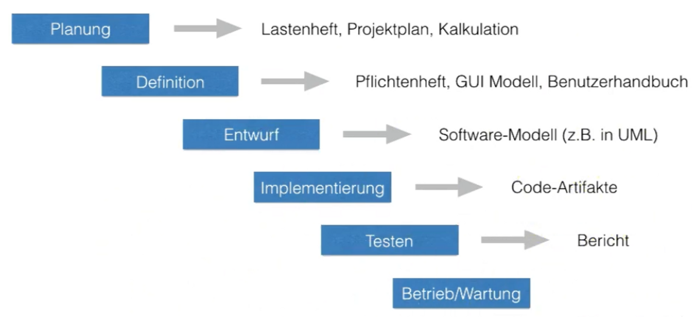

Pro:
- Einfaches Modell
- Projektfortschritt transparent
- Produkt ist gut dokumentiert
    - Der Prozess ist auf Dokumente ausgelegt
    - Die Dokumente weden abgenommen, müssen daher qualitativ gut sein

Contra:
- Keine gute Auslastung der Kapazitäten
- Klare Phasengrenzen sind oft nicht realisierbar
- Lösungsalternativen werden früh verworfen
- Mehraufwand durch Dokumentation
- Unflexibel gegenüber Anforderungsänderungen
- Rücksprünge sind überlicherweise notwendig
    - Wiederspruch in den Anforderungen
    - Im Test werden Bugs gefunden
- Ein Rücksprung erfordert dass alle Meilensteine neu abgenommen werden

Nur Sinnvoll, wenn Rücksprünge möglich sind und keine großen Anforderungsänderungen erwartet werden, z.B. in eingebetteten Systemen oder sicherheitskritischen Anwendungen.

## Iterative Vorgehensmodelle
- Umgeht das Problem, dass alle Annahmen von Anfang an richtig sein müssen
- Z.B. Wasserfallmodell wird mehrfach durchlaufen

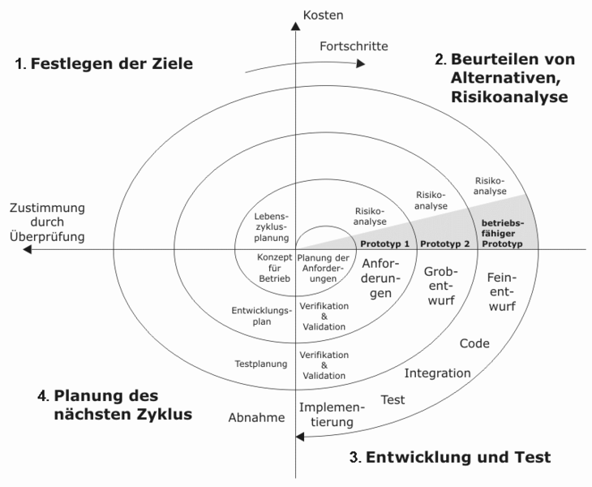

Was wollen wir in den einzelnen Iterationen Entwickeln?
=> Mit einem Basissystem starten und dieses Basissytem dann schrittweise erweitern. (inkrementelle Entwicklung)

## Prototypen

Entwicklung ablauffähiger Teile der Software
- Anforderungen klären
- Machbarkeit überprüfen
- Alternativen erforschen
- Erfahrungen mit nicht vertrauten Technologien sammeln

**vertikaler Prototyp**
- Ausschnitt quer durch alle Schichten der Anwendung
- Überprüfung der Machbarkeit
- Einzelne Funktionalitäten implementieren

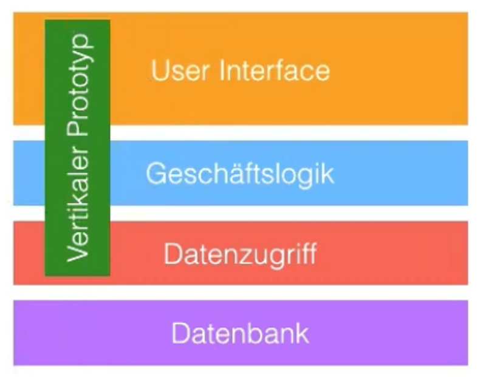

**Horizontale Prototyp**
- Entwicklung einer einzelnen Schicht ohne Implementierung anderer Schichten
- Anforderungsstabilisierung
- Meistens UI

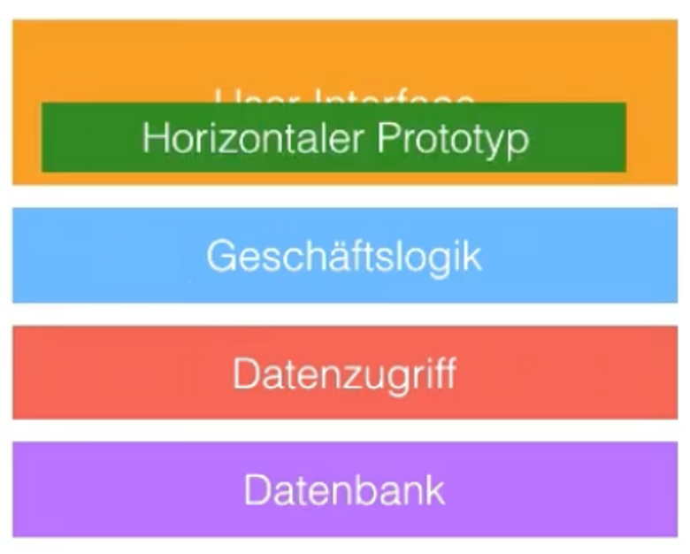

**Vorteile:**
- Risikominimierung
- Konkrete Vorstellung
- Basis für weitere Planung

**Nachteile:**
- Aufwand
- Gefahr durch falsche Ausschnittswahl

**Achtung:** Nie die Entwicklung mit einem Kern, der aus einem zusammengehackten Wegwerfprototyp besteht, starten. Der Wegwerfprototyp hatte das Ziel etwas zu lernen und dieser Zweck ist erfüllt.

## Agile Vorgehensmodelle
Die Entwicklung findet in kurzen iterativen Zyklen statt. Man fängt mit den wichtigsten Anforderungen an und nach jedem Zyklus wird die Anwendung erprobt und daraus gelernt.

Anforderungen:
- ständigen Austausch mit Product Owner (schnelle Feedbackschleife)
- Jederzeit Änderungen der Anforderungen begrüßen
- Dafür hohe Wartbarkeit der Software garantieren

Vorteile:
- Berücksichtigung von Anforderungsänderungen
- Feedback vom Kunden durch häufiges Ausliefern
- Fördert Kooperation im Team
- Sehr gut geeignet für Neuentwicklungen

Nachteile:
- Vertrag
- Beteiligung des Kunden wichtig
- Dokumentation weniger umfangreich

## Domain Driven Design DDD
Ziel ist die Software möglichst nah an den Prozessen und Fachmodellen der Domäne anzulehnen

### Domain
Ein Bereich von Wissen, Einfluss oder Aktivität. Das Fachgebiet, auf das der Benutzer ein Programm anwendet, ist die *Domain* (Dt.: Domäne) der Software.

### Model
Ein *Model* (Dt.: Modell) ist ein System von Abstraktionen, das ausgewählte Aspekte einer Domäne beschreibt und zur Lösung von Problemen im Zusammenhang mit dieser Domäne verwendet werden kann.

### Ubiquitous Language
Die Ubiquitous Language (Dt.: allgegenwärtige Sprache) ist eine Sprache, die um das Domänenmodell herum gruppiert ist und von allen Teammitgliedern in einem Bounded Context verwendet wird, um alle Aktivitäten des Teams mit der Software zu verbinden.
Typische Hindernisse:
- Fehlende Fachbegriffe
- Unterschiedliche Bedeutungen
- Übersetzungsfehler

### Context
Der Bereich, in dem ein Wort oder eine Aussage auftaucht und der dabei ihre Bedeutung bestimmt. *Aussagen über ein Modell können nur in einem Context (Dt.: Kontext) verstanden werden.*

### Bounded Context
Der Bounded Context (Dt.: begrenzter Kontext) ist eine Beschreibung einer Grenze (typischerweise ein Subsystem oder die Arbeit eines bestimmten Teams), innerhalb derer ein bestimmtes Modell definiert und anwendbar ist.

## Domain Storytelling
Um Wissen über die Domäne zu sammeln, gibt es im DDD sogenannte Knowledge Crunching Techniken, wie u.a. Domain-Storytelling. Das ist ein Workshop-Format, bei dem einzelne Szenarien aus der Domäne *gemeinsam durchgesprochen* und *visualisiert* werden.

# Woche 2

## Software-Architektur
## Entwicklung planen
Besonders die ersten drei Kapitel des Templates sind für uns interessant.


Ziele
Das erste Kapitel der Dokumentation soll einen schnellen Überblick darüber geben, welche Ziele die Software erreichen soll (auch Qualitätsziele)

Stakeholder
Stakeholder-Analyse durchführen
Wenn wir die Gruppen mithilfe dieses Rasters klassifiziert haben, können wir gezielter mit ihnen interagieren.

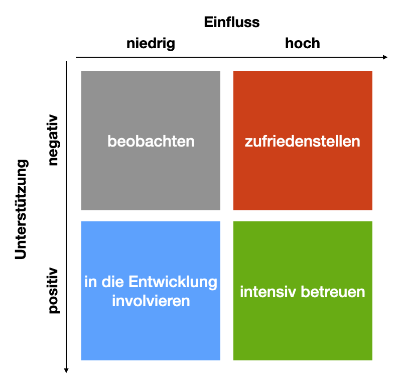

Einschränkungen
Budget, Personalausstattung und auch Qualifikationen des Teams

Kontextabgrenzung
Funktionalitäten die zum System gehören und in welcher Beziehung unser System zu Usern und externen Systemen steht

## Muster

### Das Schichtarchitektur-Muster
In einer strikten Architektur haben wir eine losere Kopplung, da eine Schicht ausschließlich eine andere Schicht verwendet. Der Preis dafür ist aber, dass wir evtl. viele Methoden liefern müssen, die Aufrufe in tiefere Schichten weiterleiten. Das kann die Performance einer Anwendung negativ beeinflussen.

Vorteile
- Einfach und leicht zu verstehen
- Klare Abhängigkeiten
- Reduktion der Kopplung von Komponenten (SRP, LCHC Low Coupling, High Cohesion)
- einheitlicher Abstraktionsgrad
- Austausch von ganzen Schichten

Nachteile
- Bei Änderungen in der untersten Schicht müssen alle darüberliegenden Schichten geändert werden

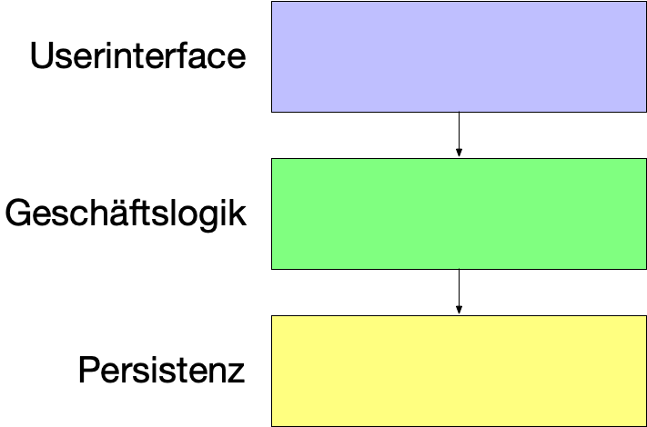

Bei den Aggregate kann es eine Klasse geben, die mehrere vollkommen unterschiedliche Aufgaben hat. Einerseits die Geschäftsaufgaben, andererseits z.B. sich aus der Datenbank zu laden und zu speichern. Das ist ziemlich deutlich eine Verletzung des Single Responsibility Prinzips.

Lösung: Das Repository-Pattern
- Verschiebung der Verantwortung der obigen Klasse in eine dedizierte Klasse (Repository). Das Repository stellt Lade- und Speicheroperationen für fachliche Objekte bereit, die Datenbank wird dabei abstrahiert. Für den aufrufenden Code wirkt ein Repository wie eine Sammlung von Fachobjekten und befindet sich nun in der Persistenzschicht.

- Mit Dependency Inversion erstellen wir zueltzt noch ein Repository-Interface in der Geschäftslogik und implementieren das Interface in der Persistenzschicht.

=> Dadurch erhalten wir die Onion Architektur

## Die Onion-Architektur
Wenn wir die Dependencies der Schichten, die von der Geschäftslogik aufgerufen werden, umdrehen, erhalten wir ein Architekturmuster, dass als Ports-and-Adapters (aka Onion Architektur) bezeichnet wird.

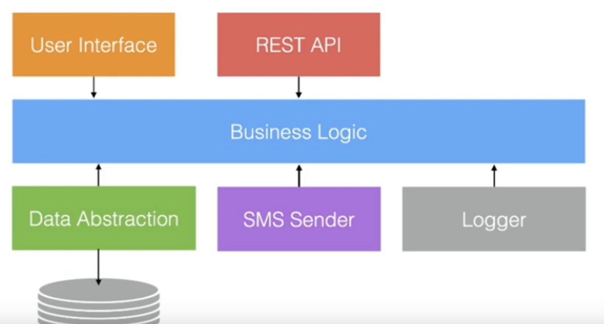
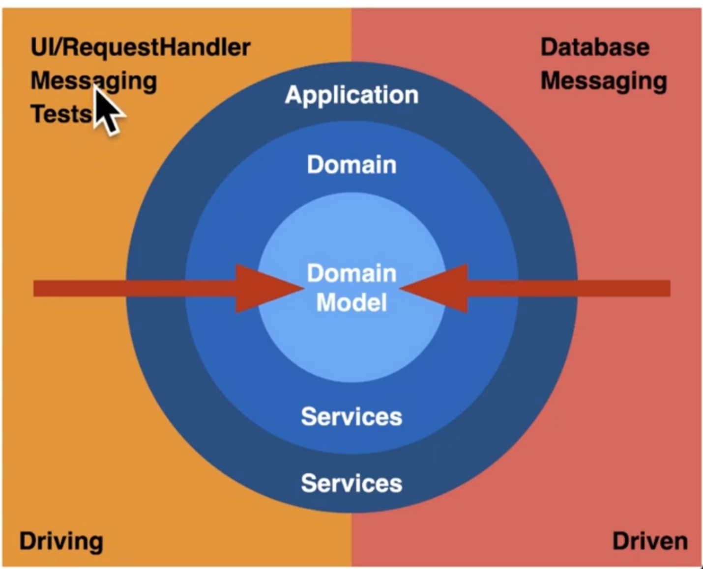

- Controller extrahieren Daten aus dem Request und bauen ModelAndView zusammen
- Application Services koordinieren einen Geschäftsvorfall (Daten laden, Geschäftslogik aufrufen, Daten speichern)
- Das Domänen Modell setzt die Geschäftsregeln um
- Repositories
    - Haben eine fachliche Schnittstelle in der Geschäftslogik
    - Werden in der Infrastrukturschicht implementiert
    
# Woche 3

## Zerlegungen eines Systems
Zerlegung eines Gesamtsystems. Ein Software-System kann aus einem oder mehreren ausführbaren Programmen bestehen. Entweder Monolithen oder Microservice-Architekturen oder etwas dazwischen.

## Code-Organisation und Building
Wir haben die Auswahl, ob wir alle Services in einem einzigen Code-Repository (Monorepo) oder jeden Microservice (oder Gruppen von Services) im jeweils eigenen Repository (Polyrepos) entwickeln.

## Technologie-Stack
Ist die Auswahl der Technologien, die benutzt wird, um eine Software umzusetzen (z.B. Betriebssystem und ggf. Virtualisierungen, Programmiersprachen, Frameworks, externe Softwareprodukte wie Datenbanken oder Messagebroker ...)
Im gegensatz zum Microservice gibt es im Monolithen nur einen Technologie-Stack.

## Transaktionen
Wenn wir in einem Programm darauf angewiesen sind, dass sich Zustand nur konsistent ändert, werden Transaktionen wichtig.
Als Transaktion eine Folge von Programmschritten bezeichnet, die als eine logische Einheit betrachtet werden, weil sie den Datenbestand nach fehlerfreier und vollständiger Ausführung in einem konsistenten Zustand hinterlassen. Daher wird für eine Transaktion insbesondere gefordert, dass sie entweder vollständig und fehlerfrei oder gar nicht ausgeführt wird.

## Monolithen

### Pro
- Übersichtliche Gesamtstruktur (Build, Deployment, ...)
- Interaktion über normale Methodenaufrufe
    - Hohe Performance
    - Zuverlässig
    - Entwicklung einfacher
- Transaktionen sind gut umsetzbar
    - Konsistenz von Daten gut einhaltbar

### Contra
- Modularisierung kann einfach umgangen werden
    - Disziplin mit Archunit
    - Modularisierung durch Submodule
- Ein Prozess = Eine Plattform
- Blast Radius bei Fehlern
    - Bei einer ungefangenen Exception stürzt das gesammte System ab.
- Skalierung (Performance und Entwicklung)

## Microservices

Monolith wird in mehrere Anwendungen aufgeteilt. Die Kommuniktation zwischen den Services geschieht nun über das Netzwerk.

### **Skalierung**

→ Unabhängige Skalierung einzelner Bestandteile

### **Komponentenbildung**

→ Modularisierung nun stärker eingehalten. Netzwerkaufruf für jeden Aufruf zwischen Komponenten notwendig

### **Polyglotte Programmierung**

→ Microservices können unabhängige Technologien verwenden. Man kann die passenste Technologie für die bewältigung der Aufgabe wählen.

### **Robustheit**

→ Blast Radius begrenzt. Stürzt ein Service ab laufen andere Services trotzdem weiter.

Nicht automatisch robust. Abhängigkeiten zwischen Services führen trotzdem zu abstürzen. Die Aufrufe zwischen Services sind nicht mehr zuverlässig.

### **Aufteilung**

Bei falscher Aufteilung verschmelzen die Nachteile von Monolithen und Microservices. Wenn für das Deployment alle Services vorhanden seien müssen, so gibt es eine falsche Aufteilung. Services sollen unabhängig von einander deployed werden können. → Autonomie

1. Aufrufe minimieren
2. Tennen zwischen Micro und Makroarchitektur

### **Makroarchitektur**

- Regeln für die Systemintegration und Kommunikation
- Regeln für die Authentifizierung und andere Metadaten
- Regeln für das Deployment und Konfiguration
- Regeln für das Monitoring

### **Autonomie**

- Services werden unabhängig voneinander entwickelt und in Betrieb genommen
- fachlichen Schnitt wählen (Bounded Context)

### **Pro**
- Technologiestack frei wählbar
- Grenzen im Code (Modularisierung)
- Services können ausgetauscht werden
- System kann auch bei Ausfall eines Services weiter funktionieren
- Skalierung ist feingranularer
- Weniger teamübergreifende Koordination

### **Contra**
- Aufrufe nicht mehr zuverlässig
- Verteilte Transactionen
- Emergentes Verhalten (Verteilter Aufruf von Code)

## Skalierung
Einen Monolithen können wir nur vollständig skalieren. Wenn wir den Produktkatalog skalieren, dann wird der Versand mitskaliert. Bei einer Microservice-Architektur können wir die Services unterschiedlich stark skalieren und auf den Bedarf anpassen.

### Vertikale Skalierung (Scale Up)

- Erhöhen der Ressourcen des Servers
- Pro
    - Keine Änderung der Software notwendig
- Contra
    - Teuer
    - Irgendwann nicht mehr möglich.

### Horizontale Skalierung (Scale Out)

- Erhöhung der Anzahl der Server
- Pro
    - Günstiger
    - Keine Hardware Grenzen
- Contra
    - Effzienz der Software entscheidend
    - Symmetrische Skalierung
        - Wenn eine Anwendung im System viel öfter genutzt wird als andere Bestandteile, so muss trotzdem die gesamte Anwendung dupliziert werden.
        - Einzelteile können nicht eigenständig skaliert werden
        - Führt zu Verschwendung von Ressourcen
    - Time to Market
        - Koordination ist problematisch
            - Feature Release
                - Man wartet auf das neue Feature das gebraucht wird, bis es fertig ist
            - Release Trains
                - Nach einem bestimmten Zeitintervall (z.B. alle drei Montate) werden alle fertigen Features released

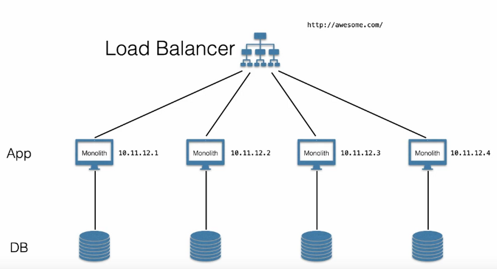

- Zustand muss zwischen den Servern geteilt werden
    - Kann gelöst werden durch Sticky Sessions (Requests vom selben User gehen an den selben Server)
    - Zustand kann immer mitgesendet werden
    - Zustand kann in einer geteilten Datenhaltung abgelegt werden

## Teamstrukturen
Conway's Law: Die Struktur von Systemen, die von einer Organisation entwickelt werden, die Kommunikationsstrukturen innerhalb der Organisationen widerspiegelt.

Conway’s Law ist ganz besonders in Microservice-Architekturen von Bedeutung, aber auch in einem Monolithen können wir Modulgrenzen haben, die dann ebenfalls von der Organisationsstruktur mitbestimmt werden.

Conway's Law positiv nutzen:
Organisation so ändern, dass wenn wir sie kopieren, genau die Architektur bekommen die wir eigentlich planen. Ändere nicht die Software-Architektur ohne das Team anzupassen.
Z.B. durch Zwei-Pizza-Teams (Teams die mit zwei Pizzen satt zu kriegen sind):
- 2-8 Personen
- alle rollen in einem Team beteiligt
- feste Teams mit einer Aufgabe
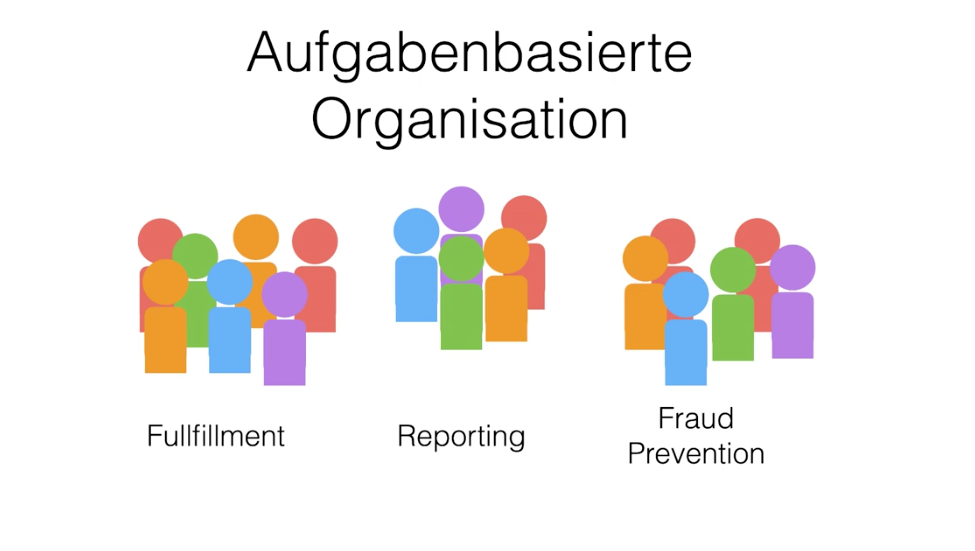

## Was ist denn eigentlich ein Microservice?
Ein Microservice kann nicht kleiner sein als ein Aggregat. 
Auf der anderen Seite soll ein Microservice von einem einzigen Team handhabbar sein, sodass wir das als Obergrenze für einen Service verwenden können.

Microservices möglichst autonom entwickeln und betreiben. Erreichen wir dadurch, dass wir die Services fachlich schneiden und ihre Abhängigkeiten zu anderen Prozessen kontrollieren. Sodass ein Service genau eine Aufgabe möglichst vollständig umsetzt.


## Verteilte Monolithen
Wenn wir eine Microservice-Architektur nicht sinnvoll schneiden, dann kann es uns passieren, dass wir einen verteilten Monolithen entwickeln.
Verteilte Monolithen sind ein Riesenproblem, da die Nachteile von Monolithen mit den Nachteilen von Microservices kombiniert werden.

## Zwischen den Extremen
Wir müssen nicht für entweder Monolithen oder Microservices entscheiden. Es gibt Lösungen, die dazwischen liegen. (siehe Self-Contained-Systems (SCS))

## Wie zerlegen wir denn nun ein System?

Z.B. können wir fachliche und technische Zerlegung kombinieren, siehe folgende Struktur:
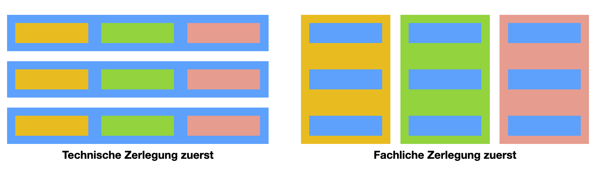

In den meisten Fällen ist die fachliche Zerlegung ein guter Startpunkt.
- Fachlich geschnittene Teilsysteme lassen sich gut auf Teams verteilen.
- Ein Monolith lässt sich dadurch im Nachhinein einfacher in Services zerlegen

Technische Zerlegung in Frontend und Backend zuerst durchführen. Wichtig wenn wir getrennte Technologien verwenden wollen.

Monolith oder viele Microservices?
- Zuerst mit einem oder einigen wenigen Monolithen starten
- Bei mehreren Monolithen den Schnitt unbedingt entlang von Bounded-Contexts vornehmen

# Woche 4

## URLs
Eine URL besteht aus dem Namen eines Schemas, gefolgt von einem Doppelpunkt. Das Schema bestimmt, wie der Teil nach dem Doppelpunkt interpretiert wird


- Authority ist die Adresse (typischerweise ein DNS-Name oder eine IP-Adresse) der für den Rest der URL zuständigen Entität.
- Path und Query gemeinsam bilden den Bezeichner einer Ressource, die von der Authority verwaltet wird
- 
## Das Hypertext Transfer Protocol (HTTP), Teil 1
### Versionen
Es gibt drei HTTP-Versionen: 
- HTTP/1.1: Klartextprotokoll
- HTTP/2: binär
- HTTP/3: binär

Die Versionen 1.1 und 2 verwenden TCP als Transportprotokoll, Version 3 verwendet das Transportprotokoll QUIC. Sowohl TCP als auch QUIC sind zuverlässige Transportprotokolle

### Request und Response
 
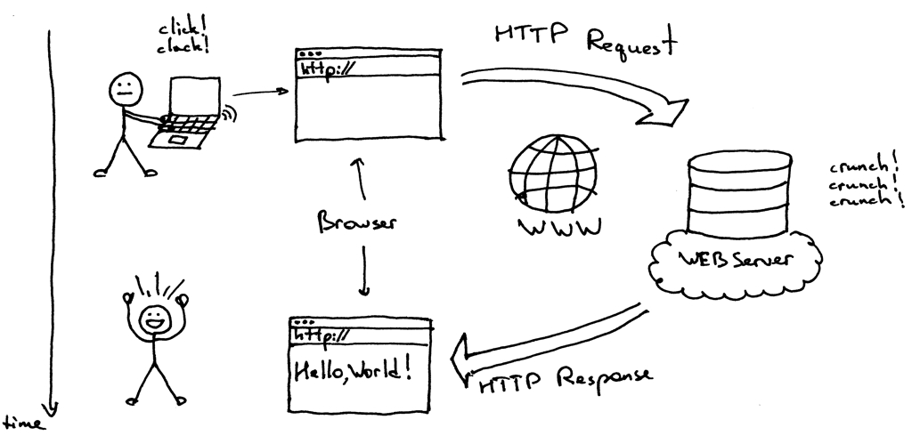

Bedeutung der Statuscodes:
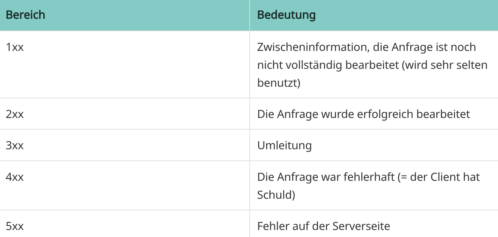

### Struktur 
HTTP ist nur für die logische Strukturierung zuständig, nicht für das Aussehen.

### HTTP-Verben
- Resourcen sind Dinge mit einer Identität, die mit einer URL adressierbar sind
- Wir bekommen nicht die Resourcen sondern Repräsentationen
- Welche Repräsentationen wir bekommen ist Verhandlungssache zwischen Client und Server
- Die HTTP Verben GET, POST, PUT und DELETE u.a. bilden eine einheitliche Kommunikation

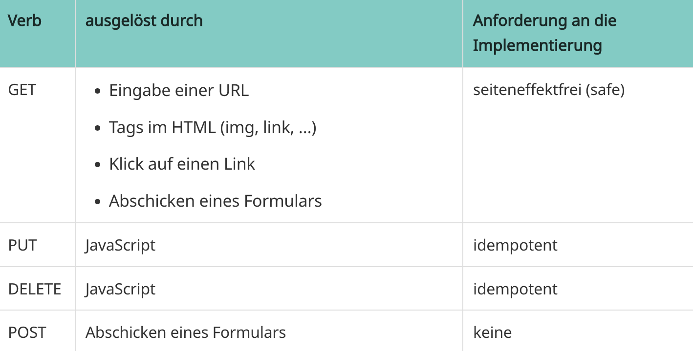

## Accessibility
(dt. oft Barrierefreiheit)
Grundregeln:
- Mausbedienung ermöglichen (Anwendung auch mit der Tastatur bedienbar)
- Farbwahrnehmung und Kontraste beachten
- Skalierbarkeit der Schriftgröße etc. ermöglichen
- Bilder mit Alternativtexten versehen
- Formularfelder mit Labeln versehen
- Mit **Screenreader** Bedienbarkeit prüfen

# Woche 5

## Webanwendungen in Java

### Servlet 
Ist eine Klasse, in der wir das Verhalten einer Webanwendung für eine URL oder eine Gruppe von URLs implementieren. Der Servlet-Container stellt für uns die komplette Infrastruktur bereit und kümmert sich um die Kommunikation mit einem Client über HTTP

- Der Webserver verteilt Anfragen aufgrund einer Konfiguration, in der URLs auf Servlets abgebildet werden.
- Der Webserver ruft in dem Servlet eine der doXXX-Methoden auf. Welche Methode aufgerufen wird, hängt vom HTTP-Verb des Requests ab.
- Die Methode hat Zugriff auf die Request-Daten (URL, Parameter, Header, ...) über ein Objekt vom Typ HttpServletRequest.
- Die Methode ändert den Zustand eines Objekts vom Typ HttpServletResponse. Dort können Header gesetzt oder der Body der Antwort erzeugt werden.
- Wenn die Methode beendet ist, wird aus dem geänderten HttpServletResponse-Objekt eine Antwort für den Browser erzeugt und abgeschickt.

## Webanwendungen mit Spring Web MVC
Das Spring Framework stellt über die Servlet-Abstraktion hinaus eine höherwertige Abstraktion bereit. Unter der Haube verwendet Spring allerdings auch Servlets.


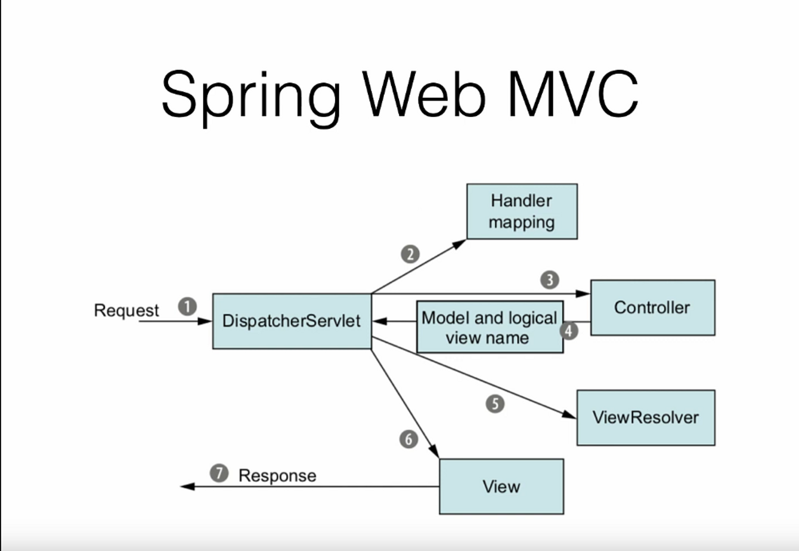
Der Request kommt beim DispatcherServlet an. Im Handler mapping wird die entsprechende Methode zurückgegeben, die die angeforderte URL im Request verarbeiten kann. Danach wird diese Methode im jeweiligen Controller aufgerufen, welcher ein Model (HashMap mit Key-Value Paaren) und ein Logischen View Name (Name einer HTML-Datei in der bestimmte Daten erstetzt werden können). Im ViewResolver wird das View Template anhand des Namen geladen  und letztlich im DispatchServlet mit dem Model vereinigt und als Response zurückgegeben.

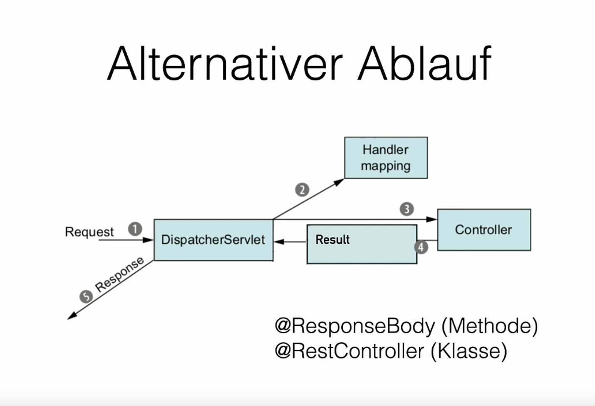
Sollte man kein View-Template benutzen wollen, so kann man im Controller z.B. JSON oder einen String mit HTML Code zurückgeben und als Resonse verschicken.

```java
@RequestMapping(method=RequestMethod.GET, path="/")
public @ResponseBody String index(){
	return "Hallo!";
}
```
```java
@RequestMapping(method=RequestMethod.GET, path="/")
public void index(HttpServletResponse resp) throws IOException{
	resp.setContentType("text/html");
	resp.getWriter().printlin("Hello!");
}
```

## Validierung

Eine Klasse von Sicherheitslücken im Bereich der Webanwendungen sind Injection-Angriffe. Es gibt unterschiedliche Varianten von Code-Injektion und Cross-Site-Scripting-Angriffen bis zu den SQL-Injections. Das gemeinsame Problem ist, dass Userinput nicht hinreichend überprüft wird.

**Niemals darauf verlassen, dass Eingaben in einem Request valide sind!**

### Objekt mit Validierung

```java
public class PersonForm {

	@NotNull
	@Size(min=2, max=30)
	private String name;

	@NotNull
	@Min(18)
	private Integer age;

	public String getName() {
		return this.name;
	}

	public void setName(String name) {
		this.name = name;
	}

	public Integer getAge() {
		return age;
	}

	public void setAge(Integer age) {
		this.age = age;
	}

	public String toString() {
		return "Person(Name: " + this.name + ", Age: " + this.age + ")";
	}
}
```

### Controller mit @Valid

```java
@GetMapping("/")
public String showForm(PersonForm personForm) {
	return "form";
}

@PostMapping("/")
public String checkPersonInfo(**@Valid PersonForm personForm, BindingResult bindingResult**) {

	if (bindingResult.hasErrors()) {
		return "form";
	}

	return "redirect:/results";
}
```

### HTML mit Validierung

```
<form action="#" th:action="@{/}" th:object="${personForm}" method="post">
    <table>
        <tr>
            <td>Name:</td>
            <td><input type="text" th:field="*{name}" /></td>
            <td th:if="${#fields.hasErrors('name')}" th:errors="*{name}">Name Error</td>
        </tr>
        <tr>
            <td>Age:</td>
            <td><input type="text" th:field="*{age}" /></td>
            <td th:if="${#fields.hasErrors('age')}" th:errors="*{age}">Age Error</td>
        </tr>
        <tr>
            <td><button type="submit">Submit</button></td>
        </tr>
    </table>
</form>
```

# Woche 6

## Testing
Was können Tests:
- Regression verhindern
- Ausführbare Spezifikation/Dokumentation/Codebeispiele geben
- Sicherheitsnetz bei Änderungen sein

Wie müssen Tests sein:
- einfacher sein als Produktivcode
- optimalerweise linearer Code
- keine komplizierte Logik
- Struktur nach AAA (Arange (Kontext herstellen), Act (Code ausführen), Assert (Ergebnis prüfen))
- Immer nur Verhalten prüfen, keine Implementierungsdetails
- FIRST Prinzipien

**F.I.R.S.T**
- **F**ast
- **I**solated and Independent
- **R**epeatable
- **S**elf-Validating
- **T**imely

### Testpyramide

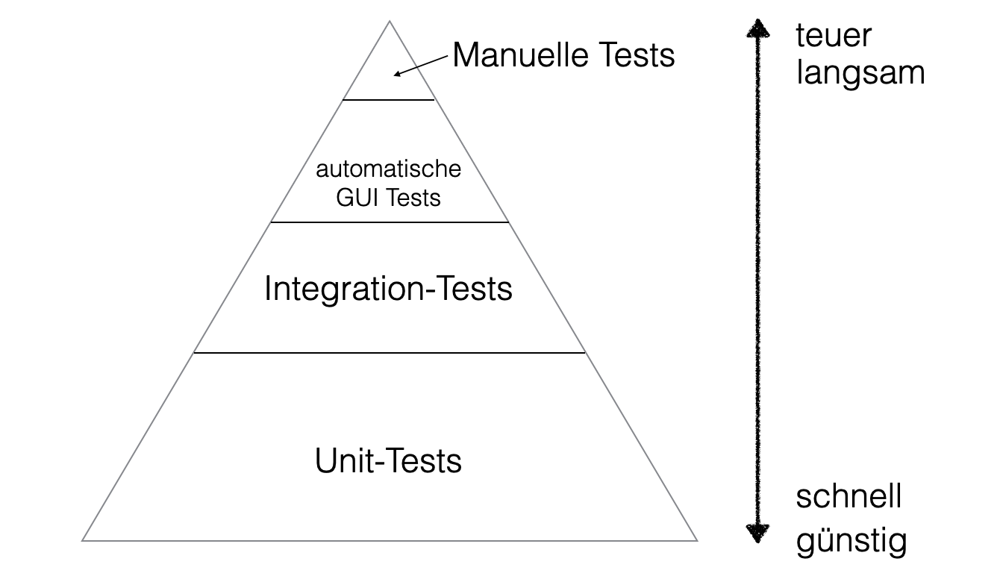

### JUnit und AssertJ in Gradle konfigurieren
```
dependencies {
    testImplementation 'org.junit.jupiter:junit-jupiter-api:5.7.0'
    testRuntimeOnly 'org.junit.jupiter:junit-jupiter-engine:5.7.0'
}

test {
    useJUnitPlatform()
}
```

### Tests schreiben mit AssertJ

